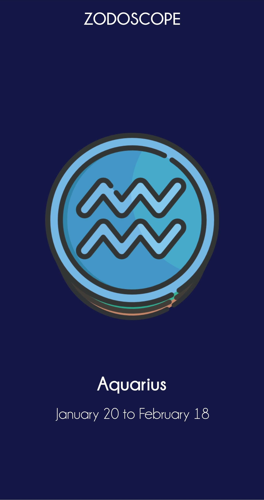
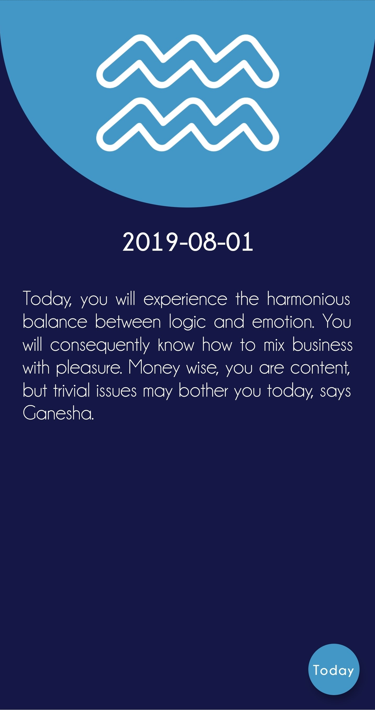

<h1 align="center">Zodoscope</h1>

  <strong>A Horoscope Forcasting Application</strong>

  Built with Flutter

API used: http://horoscope-api.herokuapp.com/

## Key Features
* __All Zodiac Signs Horoscopes__ 
  * Information about every zodiac sign's horoscope with signs
  * Beautiful slider animation with consistent zodiac icons
  * Sign hero animation between page transitions
* __API Reading and JSON Manipulation__ 
  * Using HTTP requests to take data from the mentioned API
  * Parsing JSON strings into actual string, displayable format
* __Daily, Weekly, Monthly and Yearly Forcasting__
  * Interval can be change by tapping the FAB
  * Fluid interval preview animation
* __Network Connectivity Check__ 
  * Stream listening to connectivity status
  * Error report upon internet connection issues or data retrieval 

PS: To navigate from the details screen back to the homescreen, simply swipe the sign down.

# Screenshots

  <pre>
      
  </pre>

# GIF Preview

  <pre>
    
  </pre>

